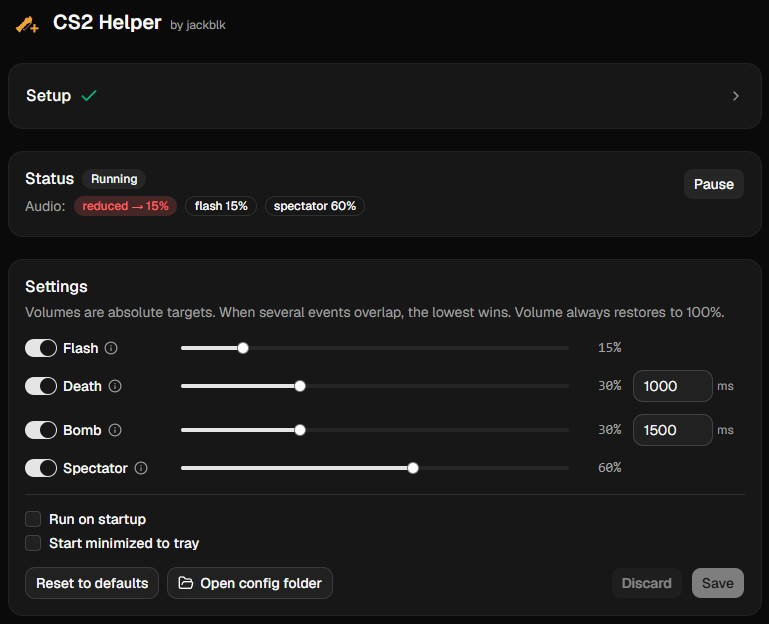
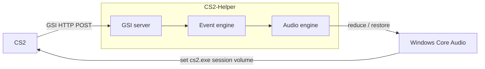

# CS2 Helper

[](https://github.com/jackblk/cs2-helper/releases)

An utility for accessibility in **Counter-Strike 2**. It automatically reduces **only CS2's** per-app volume during loud in-game events (death, flashbang, bomb, spectating) and restores it afterward.

Download latest release here: [CS2.Helper-x64.exe](https://github.com/jackblk/cs2-helper/releases/latest/download/CS2.Helper-x64.exe)

Or choose another release from [Releases Page](https://github.com/jackblk/cs2-helper/releases).

## Features

* **Anti-cheat safe**: no memory reads, DLL injection, or game file changes.
* **Event-driven**: reduces volume in response to specific in-game events (configurable).
  * Death
  * Flashbang
  * Bomb explosion
  * Spectating
* **Automatic restore**: returns volume to normal once the loud event passes.
* **Per-app volume control**: reduces only CS2's volume, leaving other apps untouched.
* **One-click setup**: installs the CS2 GSI config for you.
* **Configurable**: tune volume targets and behavior.

Currently only supports Win 11.



### FAQ

#### Will this get me banned (VAC/Faceit...)?

No. It uses official GSI (Game State Integration) provided by Valve, which is read-only and designed for third-party apps. It does not interact with the game in any way that would trigger anti-cheat systems.

#### Is this safe to use?

Yes.

* You can read, modify, or build from the source code yourself.
* VirusTotal scan is attach to each release in [Releases Page](https://github.com/jackblk/cs2-helper/releases).

#### Linux support?

Not planned at the moment, as the audio backend is Windows-specific. I also don't play games on Linux, so I wouldn't be able to test it. Feel free to contribute if you want to see it on Linux, this app uses Tauri so cross-platform support is possible.

#### Did you use AI?

Yes why not, it's just a tool. I'm a dev myself, I came up with the architechture, decicions. Feel free to contribute if you want to add features or improve the codebase.

#### I want to add X feature

Feel free to create an issue or, better, a pull request. I can't promise I'll merge every contribution, but I'm open to new features and improvements.

## How it works



The app installs a CS2 GSI config automatically, CS2 will send GSI events to the local server, and the helper adjusts the cs2.exe audio session volume in response to game events.

## Development

### Stack

* **Tauri v2** (Rust backend) + **React**
* **windows-rs** for Core Audio

### Commands

```sh
pnpm install
pnpm format       # format with Biome
pnpm tauri dev    # run the app with hot reload (Vite + Rust)
pnpm build        # typecheck + build the frontend
pnpm tauri build  # build the Tauri app (release mode)
```

Typecheck Rust without launching:

```sh
cargo check --manifest-path src-tauri/Cargo.toml
```

> Windows-only. The audio backend is gated behind `#![cfg(windows)]`.

## References

* Inspired by [PatrikZeros CSGO Sound Fix](https://github.com/patrikzudel/PatrikZeros-CSGO-Sound-Fix)
* [GSI API reference from u/Bkid](https://www.reddit.com/r/GlobalOffensive/comments/cjhcpy/game_state_integration_a_very_large_and_indepth/)
* [CS2 GSI docs](https://developer.valvesoftware.com/wiki/Counter-Strike_2_Game_State_Integration)
