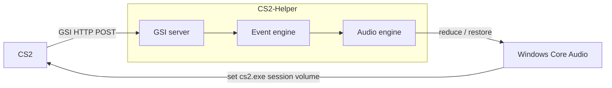

# CS2 Helper

[](https://github.com/jackblk/cs2-helper/actions/workflows/release.yml)

An utility for accessibility in **Counter-Strike 2**. It automatically reduces **only CS2's** per-app volume during loud in-game events (death, flashbang, bomb, spectating) and restores it afterward.

## Features

* **Anti-cheat safe**: no memory reads, DLL injection, or game file changes.
* **Event-driven**: reduces volume in response to specific in-game events (configurable).
  * Death
  * Flashbang
  * Bomb explosion
  * Spectating
* **Automatic restore**: returns volume to normal once the loud event passes.
* **Per-app volume control**: reduces only CS2's volume, leaving other apps untouched.
* **One-click setup**: installs the CS2 GSI config for you.
* **Configurable**: tune volume targets and behavior.


## How it works



The app installs a CS2 GSI config automatically, CS2 will send GSI events to the local server, and the helper adjusts the cs2.exe audio session volume in response to game events.

## Development

### Stack

* **Tauri v2** (Rust backend) + **React**
* **windows-rs** for Core Audio

### Commands

```sh
pnpm install
pnpm format       # format with Biome
pnpm tauri dev    # run the app with hot reload (Vite + Rust)
pnpm build        # typecheck + build the frontend
pnpm tauri build  # build the Tauri app (release mode)
```

Typecheck Rust without launching:

```sh
cargo check --manifest-path src-tauri/Cargo.toml
```

> Windows-only. The audio backend is gated behind `#![cfg(windows)]`.

## References

* Inspired by [PatrikZeros CSGO Sound Fix](https://github.com/patrikzudel/PatrikZeros-CSGO-Sound-Fix)
* [GSI API reference from u/Bkid](https://www.reddit.com/r/GlobalOffensive/comments/cjhcpy/game_state_integration_a_very_large_and_indepth/)
* [CS2 GSI docs](https://developer.valvesoftware.com/wiki/Counter-Strike_2_Game_State_Integration)
